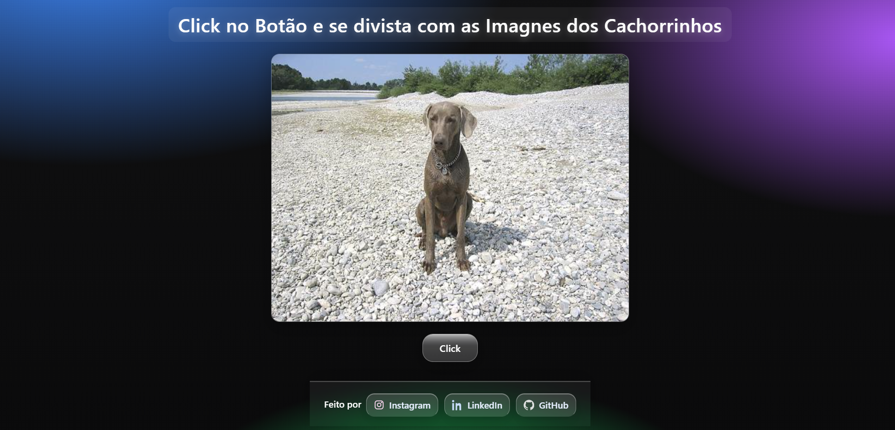
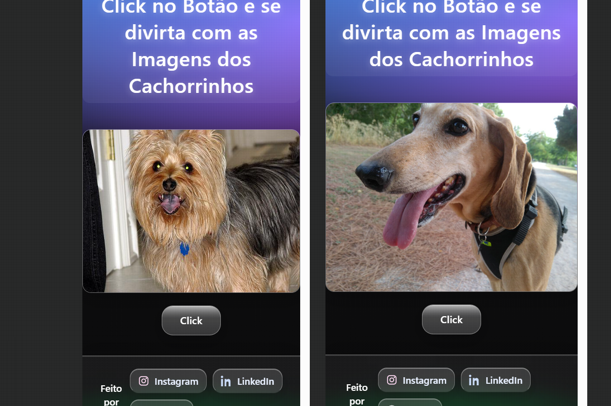

# 🐾 Dog's Imagens — Glass UI + Dog CEO API

Projeto simples, **responsivo** e estiloso (Glassmorphism no estilo iOS) que exibe **imagens aleatórias de cachorros** usando a [Dog CEO API](https://dog.ceo/api/breeds/image/random).

> Clique no botão “Click” para carregar uma nova imagem. Funciona no **desktop** e **mobile**.

---

## 🔗 Demo (GitHub Pages)

**Site online:** https://welbennyskennedy.github.io/api-img-Dogs/  
**Repositório:** https://github.com/WelbennysKennedy/api-img-Dogs

> Se você for usar outro repositório, ajuste `https://SEU_USUARIO.github.io/SEU_REPOSITORIO/`.

---

## ✨ Preview

| Desktop | Mobile |
|:--:|:--:|
|  |  |

> As imagens acima são exemplos do layout com o tema **glass** e botões translúcidos.

---

## 🚀 Tecnologias

- **HTML5**
- **CSS3** (Glassmorphism + responsivo)
- **JavaScript (Fetch API)**
- **Dog CEO API** para imagens aleatórias

---

## ✅ Funcionalidades

- 🔀 Gerar imagem aleatória de cachorro com 1 clique  
- 📱 Layout **responsivo** (desktop e mobile)  
- 🧊 **Botões glass** com hover e blur  
- 🦴 Imagem com moldura *glass* e sombra suave  
- 🦶 Rodapé com links para **Instagram**, **LinkedIn** e **GitHub**

---

## 📁 Estrutura

```
dogs-imagens/
├── index.html
├── style.css
├── README.md
└── img/
    ├── Desktop.png
    └── Mobile.png
```

---

## 🧠 Como funciona (resumo)

O botão dispara um `fetch` para:

```
GET https://dog.ceo/api/breeds/image/random
```

A resposta contém `message` (URL da imagem). O `src` da `` é atualizado dinamicamente.

---

## 🛠️ Rodando localmente

```bash
# Clone este repositório
git clone https://github.com/Fujitsu/dogs-imagens.git

# Acesse a pasta
cd dogs-imagens

# Abra o index.html no navegador
# (Windows)
start index.html
# (macOS)
open index.html
# (Linux)
xdg-open index.html
```

---

## 🌐 Deploy no GitHub Pages

1. Faça push para a branch **main** do repositório.
2. Vá em **Settings → Pages**.
3. Em **Build and deployment**, escolha:
   - **Source**: `Deploy from a branch`
   - **Branch**: `main` / **Folder**: `/ (root)`
4. Clique **Save**.

Seu site ficará disponível em:

```
https://SEU_USUARIO.github.io/SEU_REPOSITORIO/
```

> Para este projeto: **https://fujitsu.github.io/dogs-imagens/**

---

## 📸 Créditos

- Imagens fornecidas pela **[Dog CEO API](https://dog.ceo/dog-api/)** (gratuita).
- UI inspirada em **Glassmorphism / iOS**.

---

## 👨‍💻 Autor

**Welbennys Kennedy (WK Dev)**  
[Instagram](https://www.instagram.com/welbennys_kennedy) · [LinkedIn](https://www.linkedin.com/in/welbennyskennedy) · [GitHub](https://github.com/Fujitsu)
